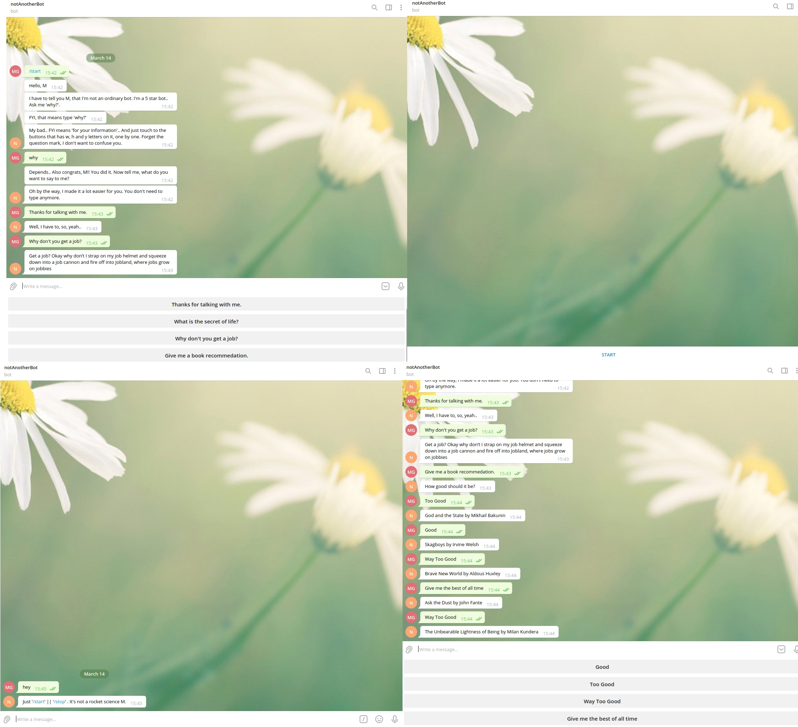

# notAnotherBot





## Built With

- Ruby
- Rspec
- Rubocop
- Telegram-Bot-Ruby
- Botfather


## Usage

### Prerequisites
- Ruby
- Rspec
- A Telegram account

### Clone
- If you want to use it locally download or clone the repo with the following command on a terminal:

```
 git clone https://github.com/mgunduz1/rubyCapstone-notAnotherBot.git
```

### Setup 
- Inside your telegram account, go to the search bar and seek for @BotFather.
- Open and start a new conversation.
- Follow the instructions to create a new bot.
- Copy your API Token and insert to the .env file in the project root.  ``` TOKEN = 'PASTE YOUR TOKEN HERE' ```
- Open a terminal in your root folder.
- Install bundles with this command  ``` bundle install ```
- Type this code to run the program  ``` ruby ./bin/bot.rb ```

### Talk to notAnotherBot
- Go back to telegram and open a new conversation with the bot you just created.


## ✒️  Author <a name = "author"></a>

👤 **Mert Gündüz**
- Github: [@mgunduz1](https://github.com/mgunduz1)
- Linkedin: [Mert Gunduz](https://www.linkedin.com/in/mert-gunduz-875280202/)


## Show your support ⭐️⭐️

If you've read this far just give up and shoot the star(looks good on job applications so..) ⭐️!


## 📝 License 

This Project is WTFP licensed. 


